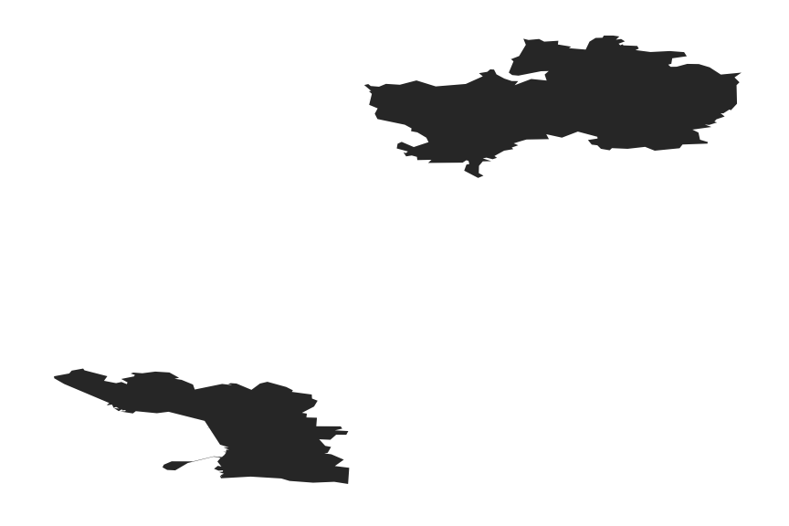

# mapDK


This is a very incomplete draft of a mapDK package for making easy ggplot2 based maps of Denmark.

Currently, the package allows you to do two things:

1. make basic maps of DK at the municipality or parish level
2. turn these maps into (static) choropleth maps

I will make it possible to create interactive choropleth maps when R's interactive libraries such as [rCharts](https://github.com/ramnathv/rCharts), [leaftletR](https://github.com/rstudio/leaflet), or [ggvis](https://github.com/rstudio/ggvis), mature a little. 

I will also add more maps with time. First on my list is probably municipalities from before the Danish municipality reform of 2005, but suggestions are welcome. 

To install the package simply run


```r
devtools::install_github("sebastianbarfort/mapDK")
```

To use the basic map simply run 


```r
library(mapDK)
mapDK()
```

 

The default plots Denmark's 98 municipalities. You can plot at the parish level by adding `detail = "parish"` in the `mapDK` call


```r
mapDK(detail = "parish")
```

 

To create a static choropleth map I've added some test data to the package. 

We can create a map by simply specifying the values and id's (as strings) and the dataset in the call to `mapDK`


```r
mapDK(values = "indbrud", id = "kommune", data = test.data)
```

 

If you don't provide names for all municipalities (or parishes), the function will throw a warning. Let's randomly remove 20 rows and plot the data again


```r
test.data.2 = mapDK::test.data[-sample(1:nrow(mapDK::test.data), 20), ]
mapDK(values = "indbrud", id = "kommune", data = test.data.2)
```

 

You can remove missing municipalities by changing `show_missing` to false and you can add a custom legend title by specifying the `guide.label` option


```r
mapDK(values = "indbrud", id = "kommune", data = test.data.2, show_missing = FALSE,
  guide.label = "test label")
```

 

You can also provide a `sub` option specifying what municipalities in your data you want plotted


```r
mapDK(values = "indbrud", id = "kommune", data = test.data, sub = c("Viborg", "Esbjerg"))
```

 

This also works for non-choropleth maps


```r
mapDK(sub = c("Viborg", "Esbjerg"))
```

 


