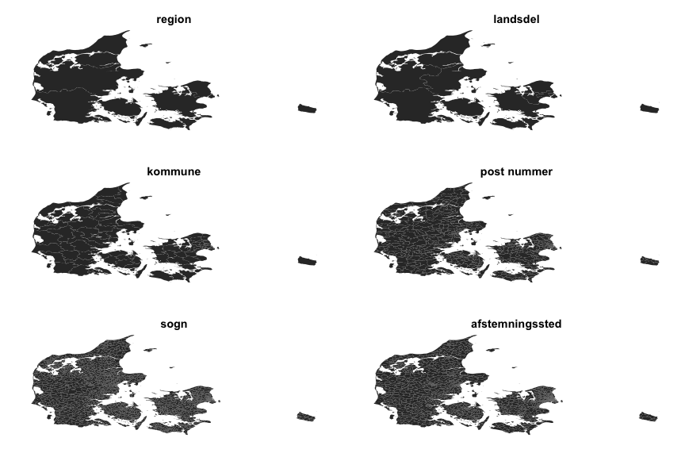
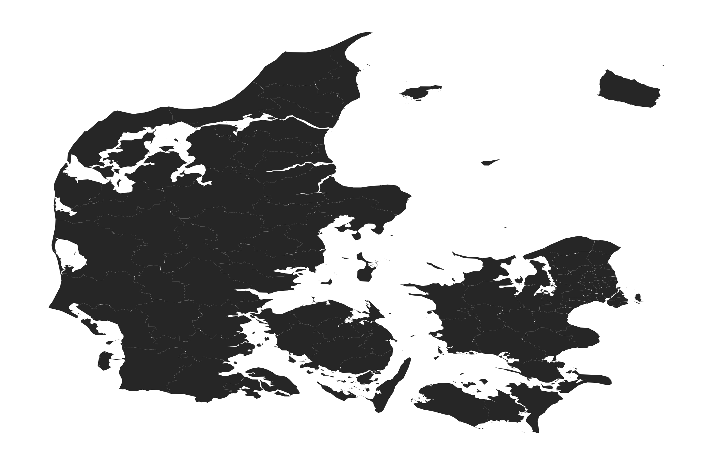
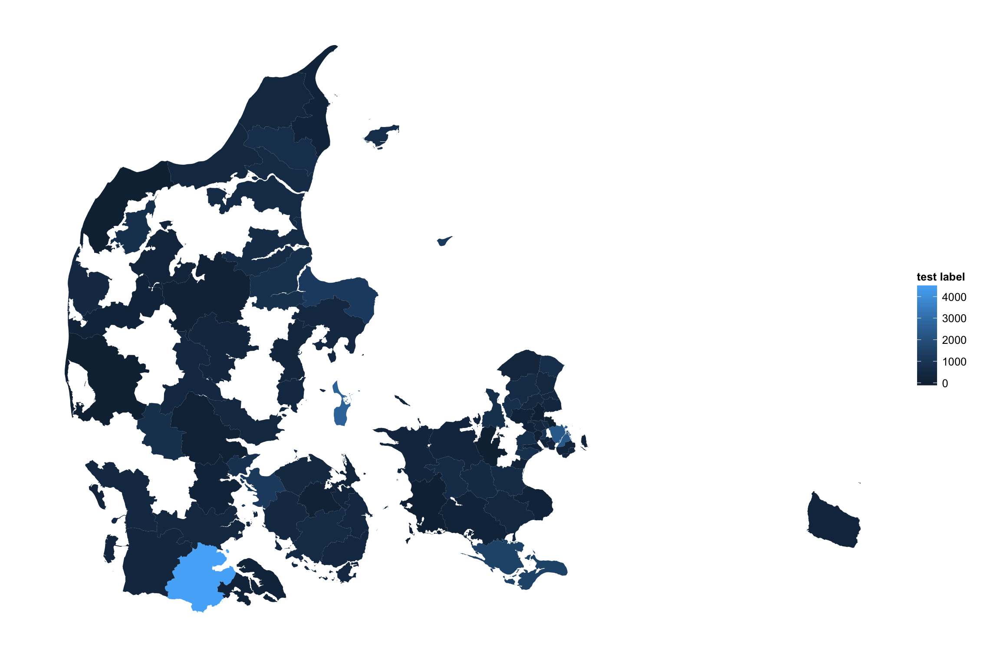
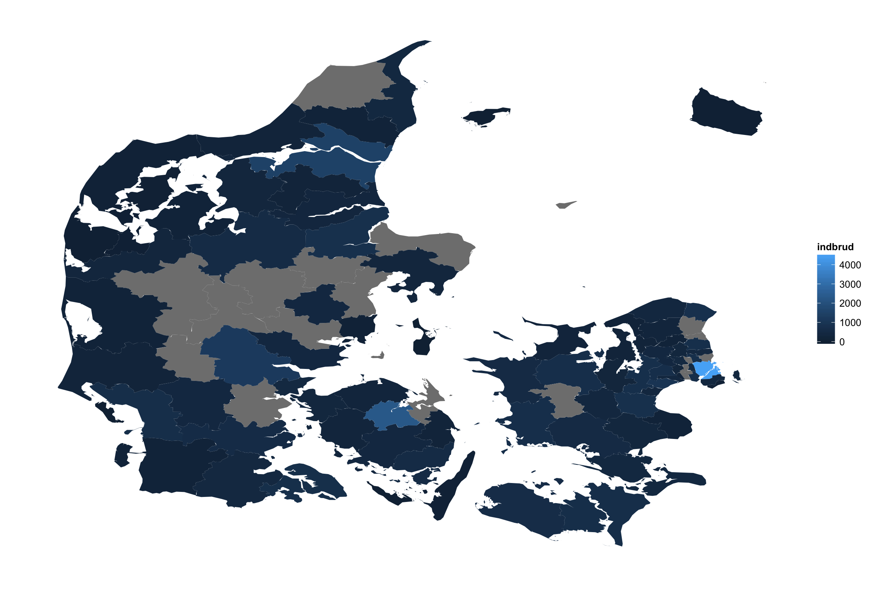
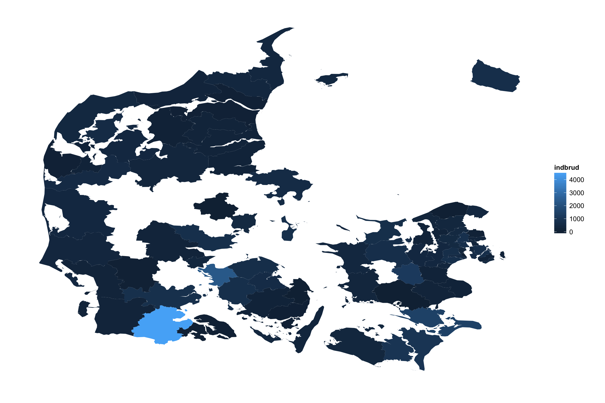
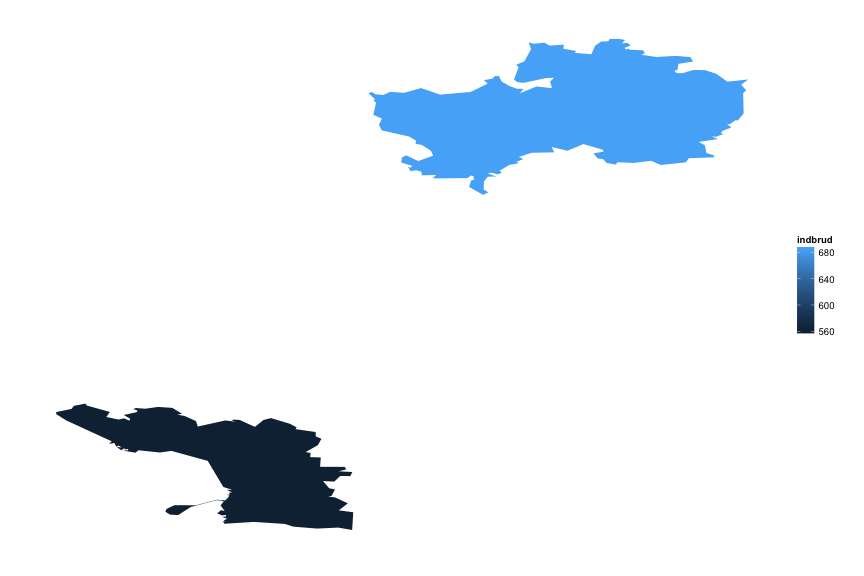

# mapDK


This is a draft of a mapDK package for making easy ggplot2 based maps of Denmark.

Currently, the package allows you to do two things:

1. make basic maps of DK
2. turn these maps into (static) choropleth maps

I will make it possible to create interactive choropleth maps when R's interactive libraries such as [rCharts](https://github.com/ramnathv/rCharts), [leaftletR](https://github.com/rstudio/leaflet), or [ggvis](https://github.com/rstudio/ggvis), mature a little. 

I will also add more maps with time. First on my list is probably municipalities from before the Danish municipality reform of 2005, but suggestions are welcome. 

To install the package simply run `devtools::install_github("sebastianbarfort/mapDK")`

To create basic maps at different levels of aggregation simply run


```r
library("dplyr")
library("ggplot2")
library("gridExtra")
library("mapDK")
region <- mapDK(detail = "region", map.title = "region")
rural = mapDK(detail = "rural", map.title = "landsdel")
municipal = mapDK(map.title = "kommune")
zip = mapDK(detail = "zip", map.title = "post nummer")
parish = mapDK(detail = "parish", map.title = "sogn")
polls = mapDK(detail = "polling", map.title = "afstemningssted")

grid.arrange(region, rural, municipal, zip, parish, polls)
```

 

To create a static choropleth map at the municipality level I've added some test data of Danish burglaries to the package. 

We can create a map by simply specifying the values and id's (as strings) and the dataset in the call to `mapDK`


```r
mapDK(values = "indbrud", id = "kommune", data = test.data)
```

 

If you don't provide names for all municipalities (or parishes), the function will throw a warning. Let's randomly remove 20 rows and plot the data again


```r
test.data.2 = mapDK::test.data[-sample(1:nrow(mapDK::test.data), 20), ]
mapDK(values = "indbrud", id = "kommune", data = test.data.2)
```

```
## Warning in mapDK(values = "indbrud", id = "kommune", data = test.data.2): You provided no data for the following ids:
## Albertslund, Ballerup, Frederikssund, Gentofte, Greve, Hillerød, Høje Taastrup, Jammerbugt, Kerteminde, Læsø, Lemvig,
## Rebild, Roskilde, Samsø, Silkeborg, Skive, Sorø, Vejle, Viborg, Vordingborg
```

 

You can remove missing municipalities by changing `show_missing` to false and you can add a custom legend title by specifying the `guide.label` option


```r
mapDK(values = "indbrud", id = "kommune", data = test.data.2, show_missing = FALSE,
  guide.label = "test label")
```

```
## Warning in mapDK(values = "indbrud", id = "kommune", data = test.data.2, : You provided no data for the following ids:
## Albertslund, Ballerup, Frederikssund, Gentofte, Greve, Hillerød, Høje Taastrup, Jammerbugt, Kerteminde, Læsø, Lemvig,
## Rebild, Roskilde, Samsø, Silkeborg, Skive, Sorø, Vejle, Viborg, Vordingborg
```

 

The call returns a `ggplot2` object which can be modified using ggplot's functionality. Say you don't like the default colering. You can modify this to your liking


```r
#devtools::install_github("karthik/wesanderson")
library("wesanderson")
test.data.2$indbrud2 = as.factor(as.numeric(cut(test.data.2$indbrud, breaks = 4)))
mapDK(values = "indbrud2", id = "kommune", data = test.data.2,
  show_missing = FALSE,  guide.label = "indbrud") +
  scale_fill_manual(values=wes_palette(n=4, name="Darjeeling2"))
```

```
## Warning in mapDK(values = "indbrud2", id = "kommune", data = test.data.2, : You provided no data for the following ids:
## Albertslund, Ballerup, Frederikssund, Gentofte, Greve, Hillerød, Høje Taastrup, Jammerbugt, Kerteminde, Læsø, Lemvig,
## Rebild, Roskilde, Samsø, Silkeborg, Skive, Sorø, Vejle, Viborg, Vordingborg
```

 

You can also provide a `sub` option specifying what municipalities in your data you want plotted. This option works for both choropleth and basic maps. 


```r
mapDK(sub = c("Aalborg", "Silkeborg", "Viborg", "Aarhus"))
```

 

## Plot Polling Place Data

You can create beautiful maps of election results at the polling place level by specifying `detail = "polling"`. To play around, I've added a dataset of Danish general election 2011 results at the polling level to play around with. Below, we plot Socialdemokratiets election results in percent at each available polling state in the map dataset


```r
mapDK(values = "stemmer", id = "id", data = dplyr::filter(votes, navn == "Socialdemokratiet"), 
      detail = "polling", show_missing = FALSE, 
      guide.label = "Stemmer \nSocialdemokratiet (pct)")
```

 


## The getID function

The `getID` function allows you to print the map key. Running this before plotting your dataset with `mapDK` is probably a good idea. 

`getID` accepts only one argument, `detail`, and using it is as easy as (it returns keys for municipalities if nothing else is specified)


```r
getID()
```

```
##  [1] "Aabenraa"           "Aalborg"            "Æroe"               "Albertslund"        "Alleroed"          
##  [6] "Århus"              "Assens"             "Ballerup"           "Billund"            "Bornholm"          
## [11] "Broendby"           "Broenderslev"       "Christiansoe"       "Dragoer"            "Egedal"            
## [16] "Esbjerg"            "Faaborg-Midtfyn"    "Fanoe"              "Favrskov"           "Faxe"              
## [21] "Fredensborg"        "Fredericia"         "Frederiksberg"      "Frederikshavn"      "Frederikssund"     
## [26] "Furesoe"            "Gentofte"           "Gladsaxe"           "Glostrup"           "Greve"             
## [31] "Gribskov"           "Guldborgsund"       "Haderslev"          "Halsnaes"           "Hedensted"         
## [36] "Helsingoer"         "Herlev"             "Herning"            "Hilleroed"          "Hjoerring"         
## [41] "Hoeje Taastrup"     "Holbaek"            "Holstebro"          "Horsens"            "Hoersholm"         
## [46] "Hvidovre"           "Ikast-Brande"       "Ishoej"             "Jammerbugt"         "Kalundborg"        
## [51] "Kerteminde"         "Koebenhavn"         "Koege"              "Kolding"            "Laesoe"            
## [56] "Langeland"          "Lejre"              "Lemvig"             "Lolland"            "Lyngby-Taarbaek"   
## [61] "Mariagerfjord"      "Middelfart"         "Morsoe"             "Naestved"           "Norddjurs"         
## [66] "Nordfyns"           "Nyborg"             "Odder"              "Odense"             "Odsherred"         
## [71] "Randers"            "Rebild"             "Ringkoebing-Skjern" "Ringsted"           "Roedovre"          
## [76] "Roskilde"           "Rudersdal"          "Samsoe"             "Silkeborg"          "Skanderborg"       
## [81] "Skive"              "Slagelse"           "Solroed"            "Soenderborg"        "Soroe"             
## [86] "Stevns"             "Struer"             "Svendborg"          "Syddjurs"           "Taarnby"           
## [91] "Thisted"            "Toender"            "Vallensbaek"        "Varde"              "Vejen"             
## [96] "Vejle"              "Vesthimmerlands"    "Viborg"             "Vordingborg"
```

Say you want the names of the parishes instead, just run `mapDK(detail = "parish")`.


