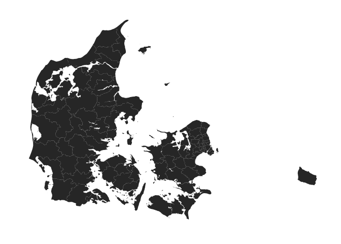
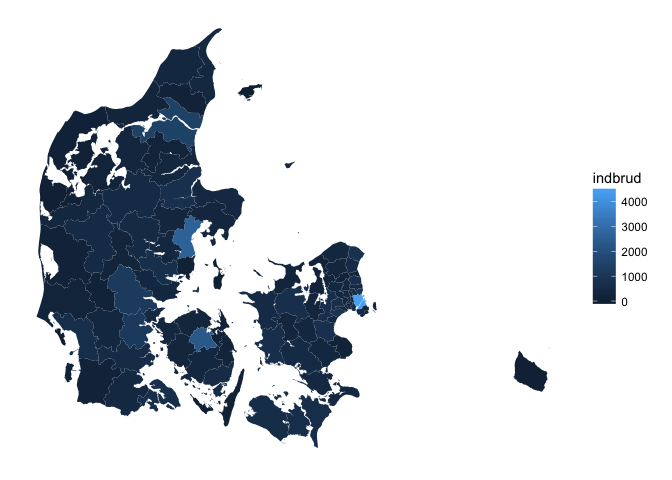
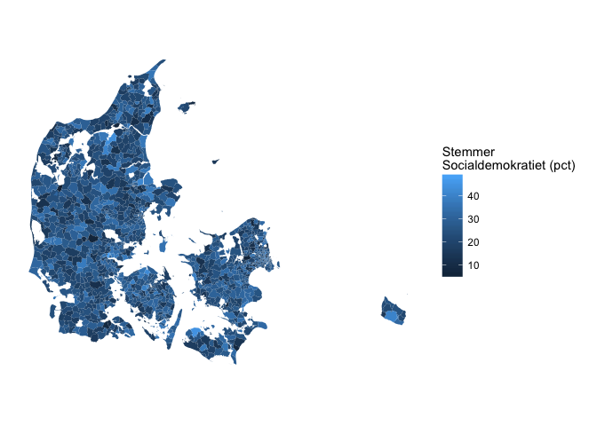
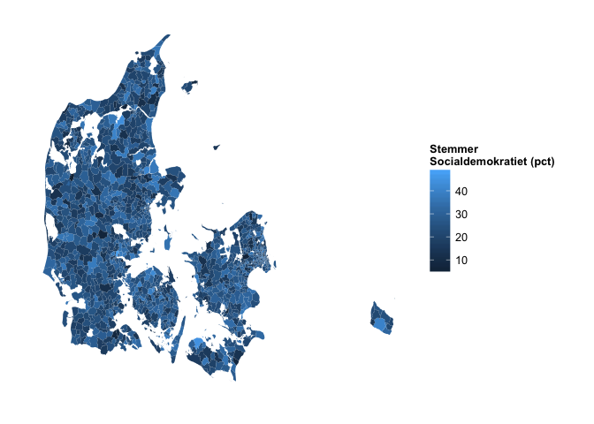
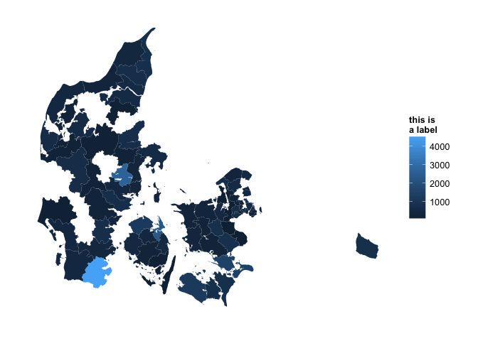
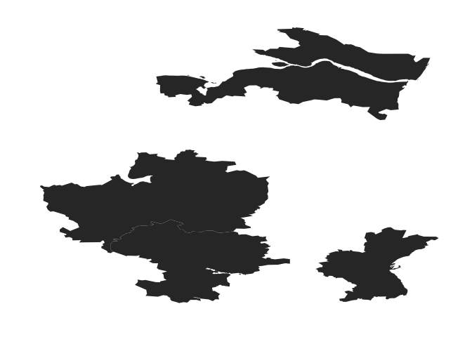

<!-- README.md is generated from README.Rmd. Please edit that file -->
This is a package for making easy ggplot2 based maps of Denmark.

Currently, the package allows you to do two things:

1.  make basic maps of DK
2.  turn these maps into (static) choropleth maps

To create a basic map of Denmark at the municipality level simply run

``` r
library(mapDK)
mapDK()
```



You can control the level of the map by specifying the `detail` argument. Currenty, `mapDK` accepts the following arguments

-   `municipality` - plots Denmark's 98 municipalities
-   `region` - plots Denmark's 5 regions
-   `rural` - plots Denmark's 11 rural areas
-   `zip` - plots Denmark's 598 zip code areas
-   `polling` - plots Denmark's 1385 polling places (as of 2015)
-   `parish` - plots Denmark's 1931 parishes

Choropleth Maps
---------------

`mapDK` also allows you to create static choropleth maps using either the package's build in datasets, of new datasets provided by the user.

### Plot Municipality Level Data

To create a static choropleth map at the municipality level we can use some data about burglaries in Denmark which are included in the package.

One creates a choropleth map simply by specifying the values and id's (as strings) and the dataset in the call to `mapDK`

``` r
mapDK(values = "indbrud", id = "kommune", data = crime)
```



If you don't provide names for all municipalities (or parishes), the function will throw a warning. Let's randomly remove 20 rows and plot the data again

``` r
crime.2 = mapDK::crime[-sample(1:nrow(mapDK::crime), 20), ]
mapDK(values = "indbrud", id = "kommune", data = crime.2)
#> Warning in mapDK(values = "indbrud", id = "kommune", data = crime.2): You
#> provided no data for the following ids: alleroed, billund, fredensborg,
#> furesoe, gentofte, glostrup, herlev, laesoe, lyngbytaarbaek,
#> mariagerfjord, middelfart, norddjurs, odsherred, ringkoebingskjern,
#> roedovre, silkeborg, solroed, soenderborg, vejen, vesthimmerlands
```



Plot Polling Place Data
-----------------------

You can create beautiful maps of election results at the polling place level by specifying `detail = "polling"`. The package includes a dataset of Danish general election 2011 results at the polling level. Below, we plot Socialdemokratiets election results in percent at each available polling state in the map dataset

``` r
mapDK(values = "stemmer", id = "id", 
  data = subset(votes, navn == "socialdemokratiet"),
  detail = "polling", show_missing = FALSE,
  guide.label = "Stemmer \nSocialdemokratiet (pct)")
```



The getID function
------------------

The `getID` function allows you to print the map key. Running this before plotting your dataset with `mapDK` is probably a good idea.

`getID` accepts only one argument, `detail`, and using it is as easy as (it returns keys for municipalities if nothing else is specified)

``` r
getID()
#>  [1] "aabenraa"          "aalborg"           "aeroe"            
#>  [4] "albertslund"       "alleroed"          "aarhus"           
#>  [7] "assens"            "ballerup"          "billund"          
#> [10] "bornholm"          "broendby"          "broenderslev"     
#> [13] "dragoer"           "egedal"            "esbjerg"          
#> [16] "faaborgmidtfyn"    "fanoe"             "favrskov"         
#> [19] "faxe"              "fredensborg"       "fredericia"       
#> [22] "frederiksberg"     "frederikshavn"     "frederikssund"    
#> [25] "furesoe"           "gentofte"          "gladsaxe"         
#> [28] "glostrup"          "greve"             "gribskov"         
#> [31] "guldborgsund"      "haderslev"         "halsnaes"         
#> [34] "hedensted"         "helsingoer"        "herlev"           
#> [37] "herning"           "hilleroed"         "hjoerring"        
#> [40] "hoejetaastrup"     "holbaek"           "holstebro"        
#> [43] "horsens"           "hoersholm"         "hvidovre"         
#> [46] "ikastbrande"       "ishoej"            "jammerbugt"       
#> [49] "kalundborg"        "kerteminde"        "koebenhavn"       
#> [52] "koege"             "kolding"           "laesoe"           
#> [55] "langeland"         "lejre"             "lemvig"           
#> [58] "lolland"           "lyngbytaarbaek"    "mariagerfjord"    
#> [61] "middelfart"        "morsoe"            "naestved"         
#> [64] "norddjurs"         "nordfyns"          "nyborg"           
#> [67] "odder"             "odense"            "odsherred"        
#> [70] "randers"           "rebild"            "ringkoebingskjern"
#> [73] "ringsted"          "roedovre"          "roskilde"         
#> [76] "rudersdal"         "samsoe"            "silkeborg"        
#> [79] "skanderborg"       "skive"             "slagelse"         
#> [82] "solroed"           "soenderborg"       "soroe"            
#> [85] "stevns"            "struer"            "svendborg"        
#> [88] "syddjurs"          "taarnby"           "thisted"          
#> [91] "toender"           "vallensbaek"       "varde"            
#> [94] "vejen"             "vejle"             "vesthimmerlands"  
#> [97] "viborg"            "vordingborg"
```

Say you want the names of the parishes instead, just run `mapDK(detail = "parish")`.

Extra Features
--------------

You can remove missing municipalities by changing `show_missing` to false and you can add a custom legend title by specifying the `guide.label` option

``` r
mapDK(values = "indbrud", id = "kommune", data = crime.2, show_missing = FALSE,
  guide.label = "this is \na label")
#> Warning in mapDK(values = "indbrud", id = "kommune", data = crime.2,
#> show_missing = FALSE, : You provided no data for the following ids:
#> alleroed, billund, fredensborg, furesoe, gentofte, glostrup, herlev,
#> laesoe, lyngbytaarbaek, mariagerfjord, middelfart, norddjurs, odsherred,
#> ringkoebingskjern, roedovre, silkeborg, solroed, soenderborg, vejen,
#> vesthimmerlands
```



Every `mapDK` call returns a `ggplot2` object which can be modified using ggplot's functionality. Say you don't like the default colering. You can modify this to your liking

You can also provide a `sub` option specifying what municipalities in your data you want plotted. This option works for both choropleth and basic maps.

``` r
mapDK(sub = c("Aalborg", "Silkeborg", "Viborg", "Aarhus"))
```


